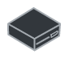

# Topology

| Image | Descriptoin |
|------|-----|
|  | Firewall |
|  | Router |
|  | Switch |
|  | Client |
|  | Server |
|  | Raspberry pi |

## Flat network

All the devides have IP assigned in the same space.

> 
> 

## Network with VLAN

Devices are getting IP addresses either in `LAN` space or in `VLAN.1` space.

